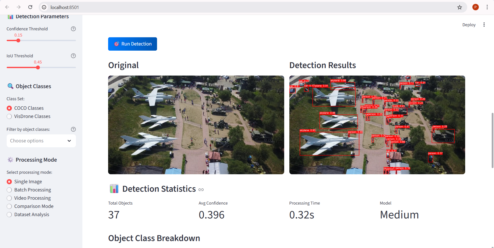
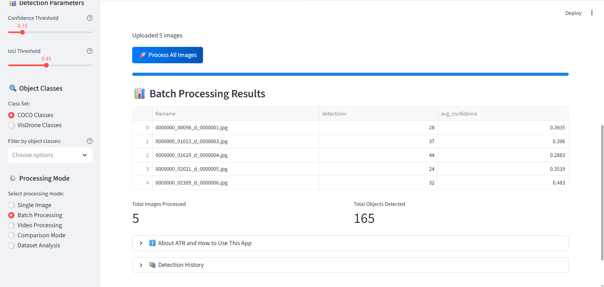
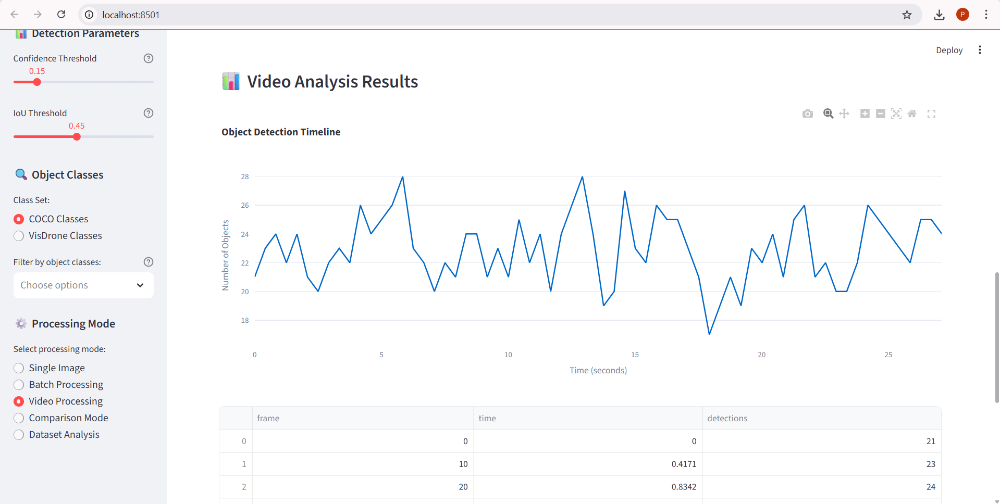
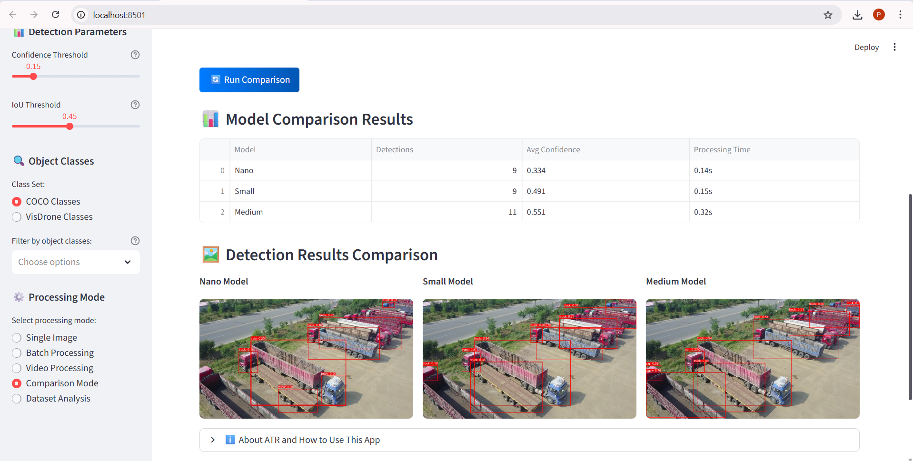

<h1 align="center">🚁 ATR — Automated Target Recognition</h1>

<p align="center">
  
  
  
  
  
  
</p>

<p align="center">
  <a href="https://atr-object-detection.streamlit.app/" target="_blank">
    
  </a>
</p>

<p align="center">
  A <b>Streamlit web application</b> for Automated Target Recognition (ATR) using <b>YOLOv11</b> — designed for drone imagery analysis with 4 processing modes, multi-model comparison, and VisDrone dataset support.
</p>

---

## ✨ Features

### 4 Processing Modes

| Mode | Description |
|------|-------------|
| **Single Image** | Upload one image, get instant detection with bounding boxes + confidence scores |
| **Batch Processing** | Analyze multiple images at once with progress tracking |
| **Video Processing** | Frame-by-frame analysis with timeline visualization |
| **Comparison Mode** | Run all three YOLOv11 models side-by-side to compare accuracy vs speed |

### Detection Controls
- **Model Selection** — YOLOv11 Nano, Small, or Medium
- **Confidence Threshold** — adjustable slider (0.0 – 1.0, default 0.25)
- **IoU Threshold** — detection overlap threshold (0.0 – 1.0, default 0.45)
- **Class Filtering** — detect only the classes you care about

### Results & Output
- Side-by-side original vs annotated image display
- Detection statistics — total objects, class breakdown, average confidence
- Color-coded confidence: 🟢 High · 🟡 Medium · 🔴 Low
- Download annotated images and JSON results
- Session-based detection history

---

## 📸 Screenshots

### Single Image Detection
> Upload a drone image → YOLOv11 detects objects with bounding boxes and confidence scores.



### Batch Processing
> Process multiple drone images at once with a per-image results breakdown table.



### Video Processing
> Frame-by-frame detection with an interactive Object Detection Timeline chart.



### Comparison Mode
> Run Nano, Small, and Medium models simultaneously — compare detections, confidence, and speed.



---

## 🤖 Models

| Model | Size | Speed | Accuracy | Best For |
|-------|------|-------|----------|----------|
| **YOLOv11 Nano** | ~6 MB | Fastest | Good | Real-time / edge devices |
| **YOLOv11 Small** | ~22 MB | Balanced | Better | General purpose |
| **YOLOv11 Medium** | ~50 MB | Slower | Best | High-accuracy research |

Models are **downloaded automatically** on first use — no manual setup needed.

---

## 🎯 VisDrone Detection Classes

The app supports the full **VisDrone2019** dataset with 10 drone-specific classes:

| ID | Class | ID | Class |
|----|-------|----|-------|
| 0 | pedestrian | 5 | truck |
| 1 | people | 6 | tricycle |
| 2 | bicycle | 7 | awning-tricycle |
| 3 | car | 8 | bus |
| 4 | van | 9 | motor |

Also supports all **80 COCO classes** out of the box (persons, vehicles, aircraft, boats, and more).

---

## 🚀 Quick Start

### 1. Clone & Install

```bash
git clone https://github.com/aishanimishra/ATR-Object-Detection.git
cd ATR-Object-Detection
pip install -r requirements.txt
```

### 2. Run

```bash
streamlit run app.py
```

Open **http://localhost:8501** in your browser.

### 3. Use

1. Select a processing mode from the sidebar
2. Choose your YOLOv11 model size
3. Adjust confidence and IoU thresholds
4. Upload your image / video
5. Click **Run Detection** → view results and download outputs

---

## 🛠️ Tech Stack


| Layer | Technology |
|-------|------------|
| **Web Framework** | Streamlit |
| **Object Detection** | Ultralytics YOLOv11 |
| **Computer Vision** | OpenCV |
| **Deep Learning** | PyTorch + TorchVision |
| **Data Processing** | NumPy · Pandas |
| **Visualization** | Plotly · Matplotlib · Seaborn |
| **Config** | PyYAML |

---

## 📁 Project Structure

```
ATR-Object-Detection/
├── app.py                 # Main Streamlit application
├── dataset_tools.py       # VisDrone dataset utilities
├── visdrone_config.yaml   # VisDrone dataset configuration (10 classes)
├── VISDRONE_GUIDE.md      # Guide for setting up VisDrone dataset
├── assets/
│   ├── Single_Image_Analysis/
│   ├── Batch_Processing/
│   ├── video_processing/
│   └── Model_Comparision/
├── requirements.txt
└── runtime.txt
```

---

## ⚙️ Requirements

- Python 3.8+
- 4 GB+ RAM recommended
- CUDA-compatible GPU (optional — CPU works fine)
- Web browser with JavaScript enabled

---

## 🔧 Troubleshooting

| Issue | Fix |
|-------|-----|
| Model loading error | Check internet connection · verify disk space · confirm PyTorch install |
| No objects detected | Lower the confidence threshold |
| Memory error | Switch to Nano model · reduce image resolution · process images individually |
| Slow video processing | Process every Nth frame · use Nano model |

---

## 👥 Team

| Member | GitHub |
|--------|--------|
| **Aishani Mishra** | [@aishanimishra](https://github.com/aishanimishra) |
| **Abhineet Raj** | [@Abhineetraj07](https://github.com/Abhineetraj07) |

---

## 🤝 Contributing

1. Fork the repository
2. Create a feature branch (`git checkout -b feature/your-feature`)
3. Commit your changes (`git commit -m 'Add your feature'`)
4. Push to the branch (`git push origin feature/your-feature`)
5. Open a Pull Request

---

## 📄 License

This project is licensed under the MIT License — see the LICENSE file for details.

---

## 🙏 Acknowledgements

- [Ultralytics](https://github.com/ultralytics/ultralytics) — YOLOv11 implementation
- [Streamlit](https://streamlit.io/) — web framework
- [OpenCV](https://opencv.org/) — computer vision operations
- [VisDrone Dataset](https://github.com/VisDrone/VisDrone-Dataset) — drone imagery benchmark
- [Plotly](https://plotly.com/) — interactive visualizations

> ⚠️ **Note**: Designed for educational and research purposes. Ensure compliance with local regulations when using for surveillance or military applications.
